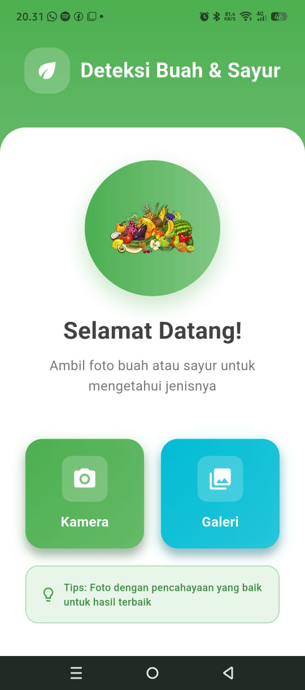
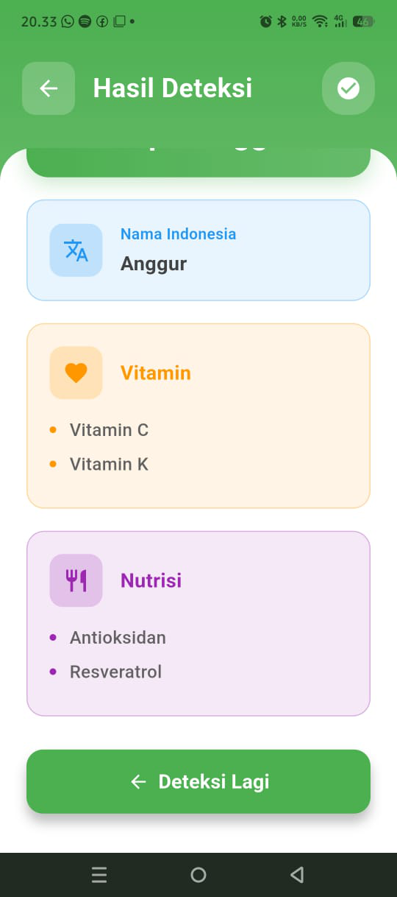

# fruit_veg_app

Aplikasi deteksi buah dan sayur berbasis Flutter. Aplikasi ini dapat mengenali jenis buah/sayur dari gambar, lalu menampilkan informasi nutrisi secara otomatis. Cocok untuk edukasi, diet, dan referensi gizi sehari-hari.

## Prasyarat

- [Flutter SDK](https://docs.flutter.dev/get-started/install) sudah terinstal
- Android Studio/Xcode/VS Code (opsional, untuk emulator/device)
- Device/emulator Android/iOS

## Instalasi & Menjalankan Aplikasi

1. Clone repository ini:
   ```bash
   git clone <repo-url>
   cd fruit_veg_app
   ```
2. Install dependencies:
   ```bash
   flutter pub get
   ```
3. Jalankan aplikasi di emulator/device:
   ```bash
   flutter run
   ```

## Struktur Folder Penting

- `lib/` : kode utama aplikasi (UI, logic, model)
- `assets/` : file model ML, gambar, data nutrisi
- `android/`, `ios/`, `web/`, `linux/`, `macos/`, `windows/` : konfigurasi platform
- `test/` : unit/widget test

## Build APK (Android)

```bash
flutter build apk --release
```
Hasil build ada di `build/app/outputs/flutter-apk/app-release.apk`

## Menambahkan & Menampilkan Screenshot

Contoh menampilkan screenshot aplikasi di README:





## Sumber Referensi
- [Dokumentasi Flutter](https://docs.flutter.dev/)
- [Codelab Flutter](https://docs.flutter.dev/get-started/codelab)

---

Silakan modifikasi README ini sesuai kebutuhan proyek Anda.
